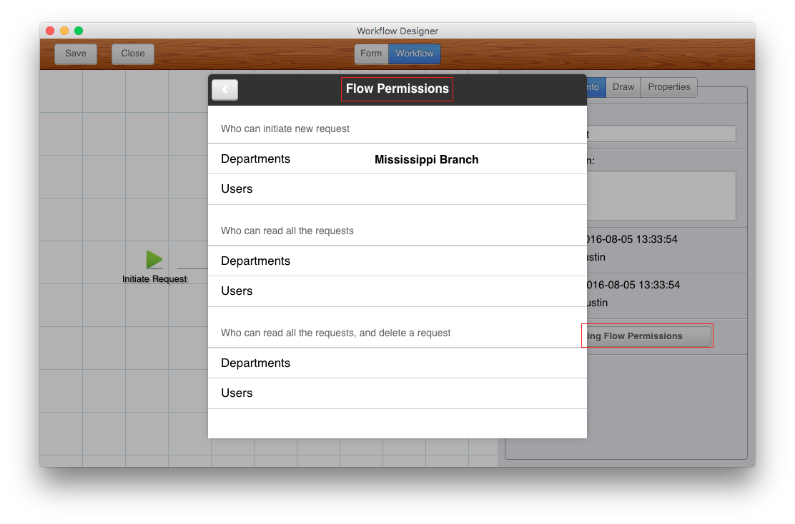

## Flow permissions

### Who can initiate requests?

Admins can set flow permissions. All users, users in specific organization or specific users can initiate requests according to permission settings. 
Here are the two methods to set flow permissions.

**Method One**
- Click “Settings” => “Workflow Designer”.
- Select a flow in workflow list of a specific category.
- Click “Initiate Request” => “Properties”.
- Select the users who can initiate this request in department box and user box.

**Method Two**
- Click “Settings” => “Workflow Designer”.
- Select a flow in workflow list of a specific category.
- Click “Flow Info” => “Setting flow permissions”.
- Select departments and users who can initiate this request in the pop-up window.

Then users selected and in selected departments can initiate this request in Steedos Workflow.

### Who can read all the requests?

Sometimes some users need to read all the requests even though they don’t participate in the approval process. It is called “management permission”. In Steedos Workflow, it can be realized by taking following steps. 

- Click “Settings” => “Workflow Designer”.
- Select a flow in workflow list of a specific category.
- Click “Flow Info” => “Setting flow permissions”.
- Select departments and users who can read all the requests in the pop-up window.

### Who can read all the requests and delete a request?

Sometimes some users need to read all the requests and delete some specific requests even though they don’t participate in the approval process. In Steedos Workflow, it can be realized by taking following steps. 

- Click “Settings” => “Workflow Designer”.
- Select a flow in workflow list of a specific category.
- Click “Flow Info” => “Setting flow permissions”.
- Select departments and users who can read all the requests and delete a request in the pop-up window.

