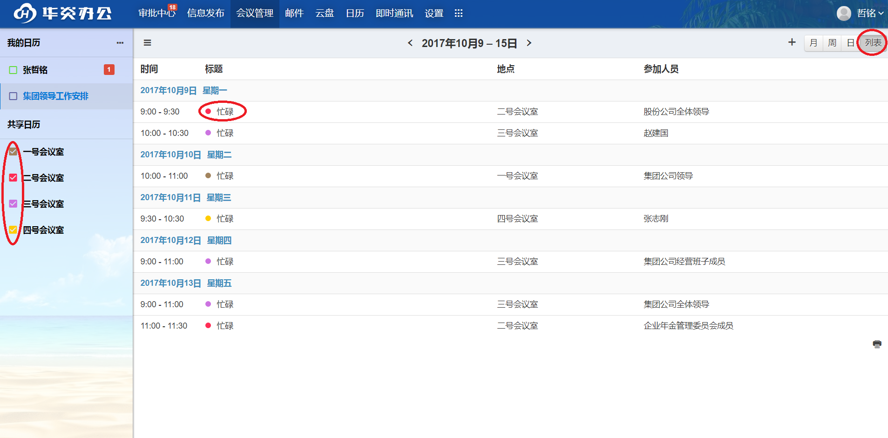
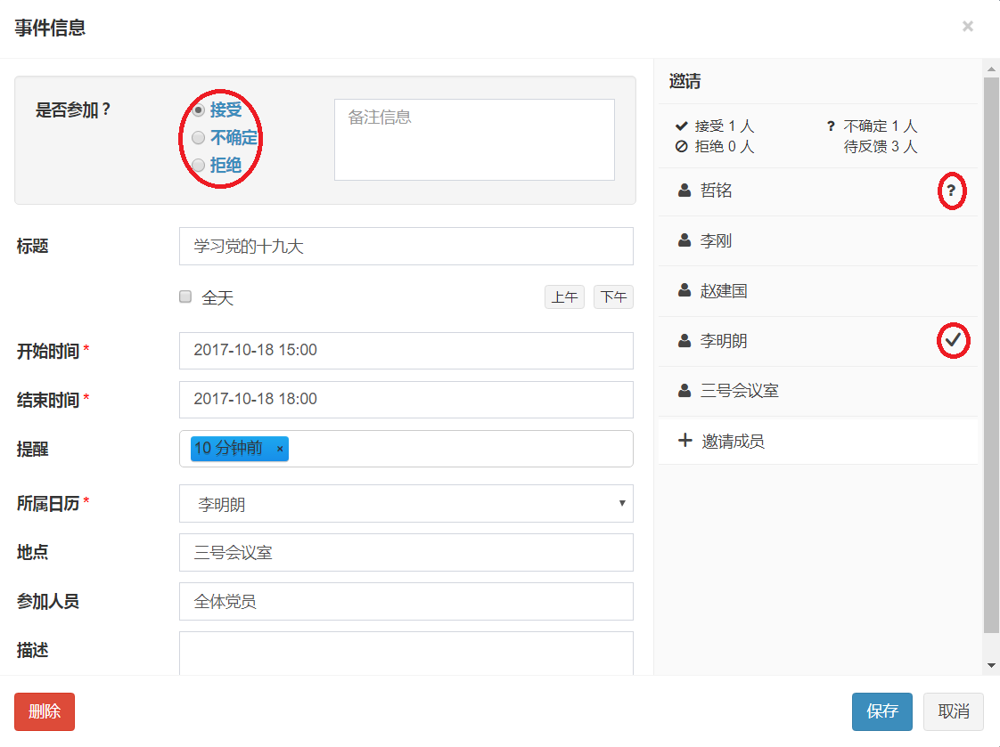
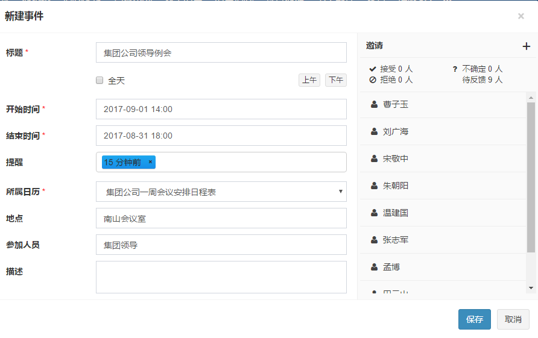
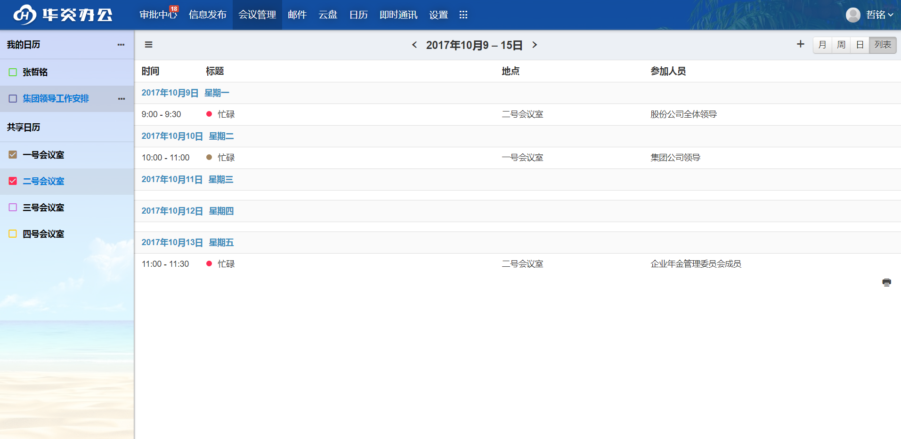
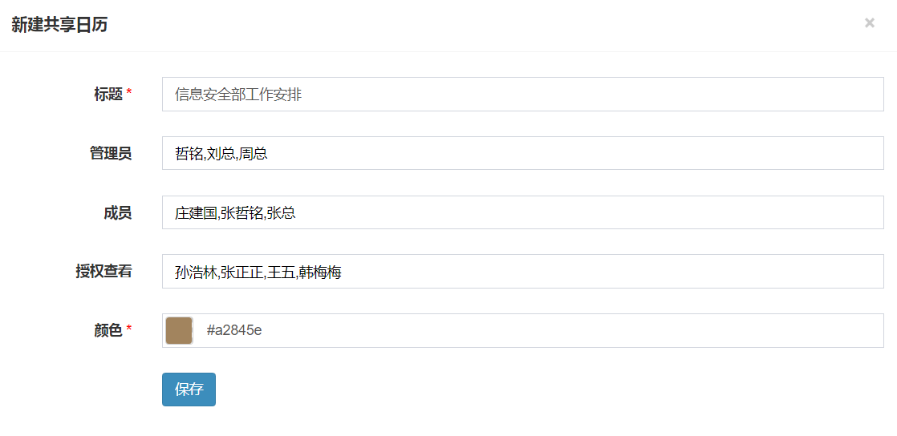


# 华炎会议管理系统

 华炎会议管理系统存在的价值就是帮您解决现实遇到的会议管理上困扰，我们的初衷只是让您更加省事省力省心。华炎会议管理系统具有以下基本功能：
  - 会议安排：高效的安排会议是本系统最基本的功能。
  - 会议提醒：系统会根据您设置的提醒时间，在会议开始之前随时随地的及时提醒您。即使您不在办公室，手机端也可以收到提醒。
  - 会议反馈：如果您有不能参加的会议，也直接在线反馈给会议组织者，系统会及时给他发送反馈通知。
  - 会议室占用情况：您在添加自己的会议之前可以先查看当前需要的会议室在会议时间段的占用情况，从而合理有效安排会议，使用会议室。
  - 了解他人工作动态：您可以知道您的同事、领导在什么时间有会议，工作沟通更有效。

## 主界面
 在主界面左侧是日历列表，右侧可以按不同方式显示会议。登录系统后，在主界面的右侧可以看到您的会议安排。您可以根据不同的查看方式查看会议。具体如下：
  - 按月：点击右上角“月”，右侧会显示您整月的会议安排，可以根据上面的“<”、“>”切换到其他月份。
  - 按周：点击右上角的“周”，右侧会显示您一周的会议安排，可以根据上面的“<”、“>”切换到其他周。
  - 按日：点击右上角的“日”，右侧会显示您某一天的会议安排，可以根据上面的“<”、“>”切换到其他日期。
  - 列表：点击右上角的“列表”，右侧会以列表的形式列出您一周的会议安排。可以根据上面的“<”、“>”切换到其他周。
  
 
## 会议查看与反馈
 除了可以显示您在某个时间段的所有会议，您也可以选择查看部分会议。具体如下：
  - 按会议室：左侧选择要查看的会议室，选中会议室前面的“□”，按上文说的查看方式查看即可。
  - 按人：左侧显示您要查看的人员，选中人员前面的“□”，按上文说的查看方式查看即可。
  - 按日历：左侧显示您要查看的日历，选中日历的“□”，按上文说的查看方式查看即可。
  

 因为权限的设置不同，有些不是我的会议安排，我们可能无法知道会议详情，而只是知道会议的发生时间和地点。比如我们在使用会议室之前，只需知道会议室在哪个时间段空闲，哪个时间段忙碌即可。

 跟我们本人有关的会议安排，我们可以看到会议的详情，根据会议详情，决定能不能参加会议。如果不能，就可以说明原因并及时反馈给会议的组织者。
  

## 会议安排
 在主界面上，点击任意“+”按钮，或选择按“月”，“周”，“日”查看时，在主界面右侧任意位置单击或拖动都会进入新增会议界面。一个会议主要包含以下几个要素：
  - 标题：会议的名称或主题。默认会议标题为“新建会议”。
  - 时间：包括开始时间和结束时间。可以点击“全天”，“上午”，“下午”快捷生成时间。也可以点击编辑框自行选择时间。
  - 地点：输入会议地点。在选择会议室之前，可以先了解会议室的占用情况。
  - 参会人员：点击右上角的“+”，进入选人界面，选择参会人员和会议室即可。
  - 提醒：在会议开始之前可设置时间点提醒，如在会议开始前10分钟提醒您参加会议。
  - 所属日历：新增会议结束后，查看会议时，选中该日历可以查看到这个会议。点击“保存”按钮，系统会给每个参会人员发送通知，他们也能看到这个会议，并作出反馈。
  

 已经建好的会议，如果有变化可以随时修改，会议的组织者点击需要修改的会议，进入会议信息界面，重新编辑需要修改的要素即可。修改之后，参会人员会收到修改通知，同时新的会议信息也会同步给他们。

 因为某些原因，已经安排好的会议也可能会取消，会议的组织者进入会议信息界面，点击“删除”按钮即可。删除之后，参会人员会收到删除通知，同时在他们的账户下也会删除这个会议安排。普通的参会人员也可以删除自己账户下的某个会议安排，删除之后，系统认为您是不参加此会议，只有会议的组织者会收到反馈通知。

## 会议室管理
 开会就必须使用会议室，合理的使用会议室才能避免会议冲突的尴尬。在新增或修改会议之前，先了解会议室的占用状况就很有意义了。
 - 订阅您想要使用的会议室。在主界面左侧，按会议室查看会议。
 - 根据您希望知道该会议室在某个时间段的占用情况，选择查看方式。

 对会议室的管理可能涉及到修改会议室名称，新增会议室，删除会议室。本系统的用户角色分为管理员和普通用户，将会议室虚拟为普通用户，对普通用户的编辑操作可用来操作会议室。
  

## 日历
 日历是会议的容器，一个日历包含多个会议，同一个会议也可以被包含于多个日历里。新增或修改会议时，只能选择一个日历。
 本系统的日历分为“我的日历”和“共享日历”两个模块，个人日历、共享日历两种日历，普通用户对日历的操作分管理员、成员、授权查看三种身份。
 - 个人日历: “我的日历”包含个人日历和普通日历。个人日历是系统为每一个使用华炎会议管理系统的用户默认建立的日历，以用户名命名，
	您可以修改个人日历，但是不可以删除。
 - 共享日历: 共享日历是属于其他用户的日历，但是授权给您查看或您订阅的日历的集合。
	其他用户在编辑日历时，选择让您授权查看，那么该日历就属于您的“共享日历”一栏，您也可以订阅其他用户的日历（具体见订阅日历一节），该用户同意后，他的个人日历就会出现在您的“共享日历”一栏。
 - 管理员: 管理员拥有最高的权限，不仅可以修改日历的基本属性和在日历上添加会议，也可以编辑修改管理员、成员、授权查看用户。
 - 成员: 成员不能修改日历的基本属性，也不能编辑管理员、成员、授权查看用户，但是可以在日历上添加会议。
 - 授权查看用户: 此类用户的等级最低，不能修改，也不能在日历上添加会议，只能查看该日历上会议的详情。
 - 日历的添加与维护：

      1. 新增日历：普通用户会有自己的个人日历，不可以新增日历，工作区管理员可新增日历。点击“我的日历”一栏右侧的“…”，选择“新建共享日历”
      2. 修改日历：在“我的日历”下，选择要修改日历，点击日历右侧的“…”，选择“编辑日历”，进入日历编辑界面，修改之后保存即可。
      3. 删除日历：在“我的日历”下，选择要修改日历，点击日历右侧的“…”，选择“删除日历”。
  

## 订阅日历
 订阅日历是指您想了解其他用户的工作动态，空闲忙碌状况可以申请点阅他的个人日历。订阅其他用户，您只能看到他的空闲忙碌状态，不能看到他的会议详情。具体订阅如下：
 - 在“我的日历”栏右侧，点击“…”，点击“订阅他人日历”。在弹出的选人窗口中，选择您要订阅的用户即可。
 - 其他用户会收到你的订阅申请，他有权同意或拒绝。如果他同意您的订阅申请，他的个人日历会出现在您的“共享日历”一栏里，您可以选中该日历，在右侧查看该用户的空闲忙碌状态。
 - 您也可以直接点击个人日历一栏的“…”，点击授权查看忙碌状态，选择要授权的人，这样如果他想订阅您的日历，就不需要您再次同意，便可订阅成功。

## 手机同步（专业版）
 华炎会议管理系统支持同步到手机系统自带的日历上，您即使不装我们软件的手机版也能随时随地同步到最新的数据。而且这种同步是双向的，您在PC上使用本软件对日历和事件做的修改，会立刻同步到您的手机上，当然您也可以在手机自带的日历软件上对日历和事件做修改，
 同样会同步到我们的日历软件上。具体操作如下：
 - 设置->日历->账户->添加账户->其他->添加CalDav账户
 - 输入服务器，用户名和密码。如https://cn.steedos.com，您的账号和密码
 - 下一步，连接上服务器，将日历和事件同步到您的设备上即可。

 注：此功能需要付费才能使用。
