# 华炎Creator快速开发平台 使用指南

## 导航栏
- [登录与设置](quickguide.md#登录与设置)
    - [登录](quickguide.md#登录)
    - [用户设置](quickguide.md#用户设置)
- [新建表单与表单视图](quickguide.md#新建表单与表单视图)
   - [新建模型](quickguide.md#新建模型)
   - [新建字段](quickguide.md#新建字段)
   - [创建菜单](quickguide.md#创建菜单)
   - [调整表单视图](quickguide.md#调整表单视图)
- [新建tree视图](quickguide.md#新建tree视图)
- [新建搜索视图](quickguide.md#新建搜索视图)
- [新建图表视图](quickguide.md#新建图表视图)

### 登录与设置
#### 登录
若您购买了华炎软件公司提供的odoo服务，我们会告知您相应的服务器地址，为您新建数据库、管理员账户与密码。您只需连接到服务器，登录odoo平台进行后续操作。

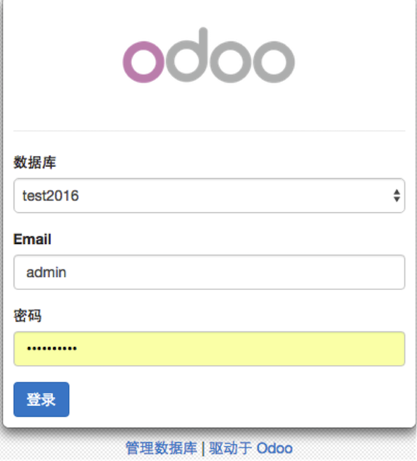

#### 用户设置
登录后，点击左侧“用户” 按钮，进行用户设置。

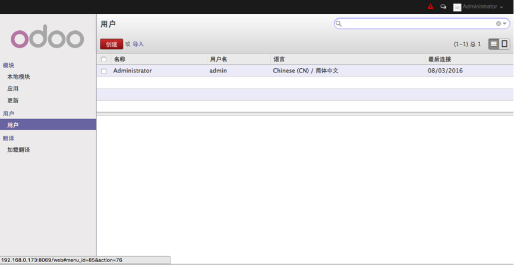

- 修改Administrator内部的信息：勾选“技术特性”，点击“保存”。再进行刷新，您会发现左侧控制面板内多了许多功能选项。
- 创建新用户：点击“创建”，输入相应的信息，勾选技术特性，点击“保存”，即可完成新用户创建。您可以添加公司内所有员工的信息。

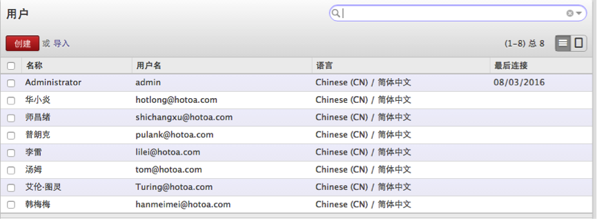

### 新建表单与表单视图
通过oddo服务，您可以按需建立您公司需要的管理系统。现以“教务管理系统”为例，为您进行介绍。
#### 新建模型
在主界面左侧面板点击“技术”=>“数据库结构” =>“模型”。之后点击“创建”，会出现模型的详细信息。标蓝部分为必填字段。

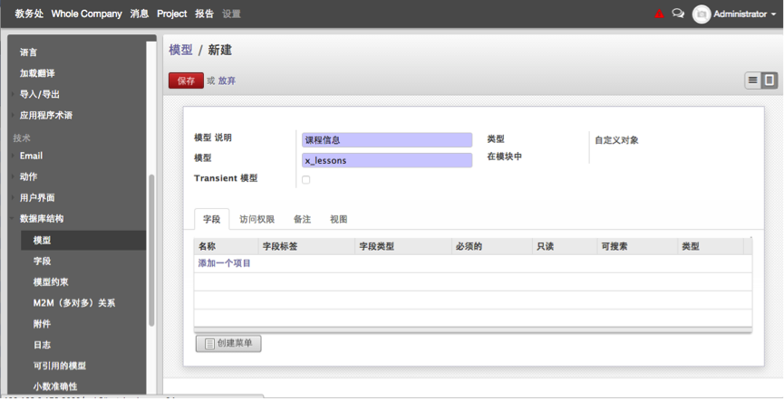

#### 新建字段
在模型界面上点击“添加一个项目”，即可在该模型内添加字段。

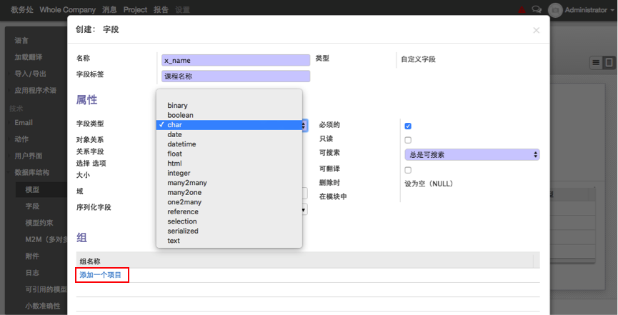

在新建字段界面内，蓝色部分的内容是必填或必选项。字段类型中可选择很多，包含：
- Binary：二进制。该类型字段加入到课程信息中，可上传教学课件或参考资料等附件。
- Boolean：布尔型。该类型字段加入到课程信息中，可用于设置课程是否是必修课。
- Char：字符型。课程名称可选为字符型。
- Text：文本型。上课地点可选为文本型。字符型可设置字节的长短，而文本型对长短没有限制。
- Date：日期。可设置开课日期。
- Datetime：日期-时间。可设置考试时间。
- Float：浮点型。可设置为课程的费用。
- Integer：整型。可设置为最大允许选课人数。
- Selection：下拉框选项。可设置为开课的院系。
- Many2one：多对一。可设置为任课老师，从系统用户中选择老师。
- Many2many：多对多。可以从系统用户中选择多预选了该课程的学生。
- Html：相较于文本类型，html类型可对其内的文字进行排版。因而可用来设置课程的简介或课程目标。

备注：在字段属性中，还可以勾选是否为必填字段，是否为只读字段以及对搜索特性进行设置。这里特别需要注意的是，对于某些特殊类型的字段，往往需要设置关联的对象。如many2one类型中，对象关系可设置为“res.users”，意思是从系统用户中选择一个。many2many类型的字段，可以在表单中生成子表。如示例中的预选学生，可以从系统用户中添加多人到预选学生子表中。

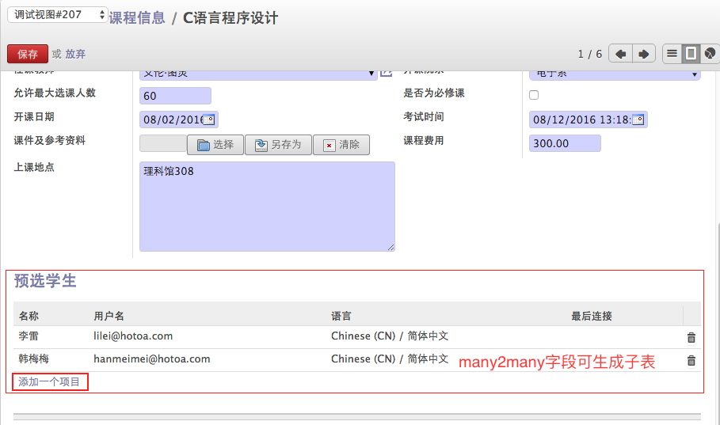

新建好所有的字段后，点击“保存”，则除了新建的字段外，会出现系统自带的基础字段，您可以忽略。

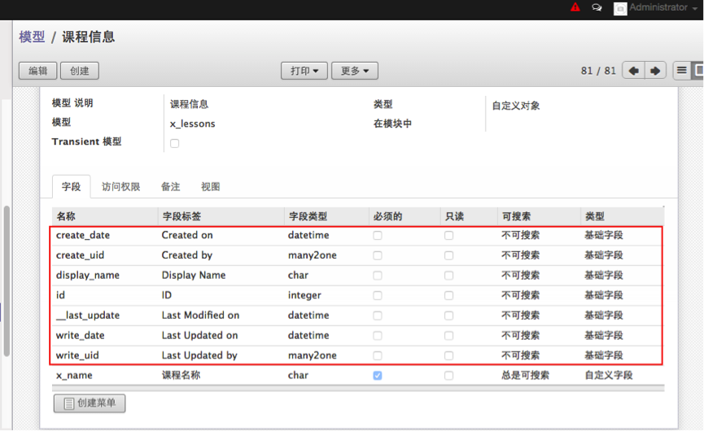

以课程信息为例，我们添加了课程信息、任课教师、上课地点、课程费用、预选学生等众多字段。

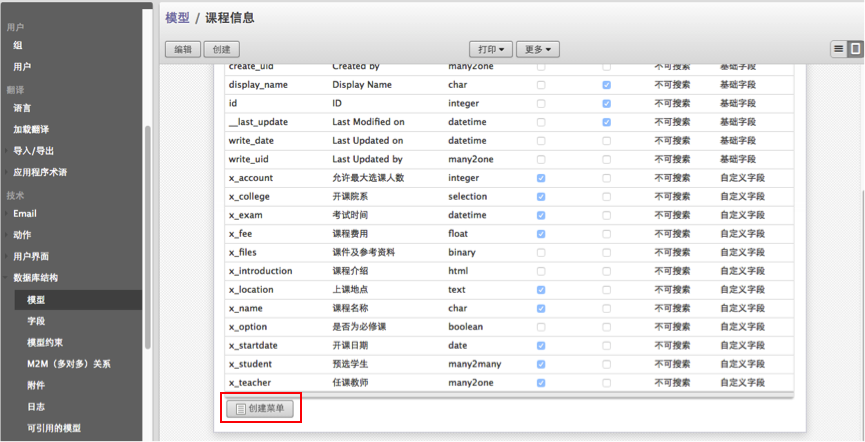

#### 创建菜单
创建好模型内的字段，需要创建至少三层以上结构的菜单，才能通过action动作显示出表单内容。现以简单的三层结构为例，三层结构为教务处/课程管理/课程信息。
具体操作是：
- 点击模型下方的“创建菜单”，在弹出的界面中，输入第三层的显示名称，创建并编辑第二层，设置第一层的显示名称。

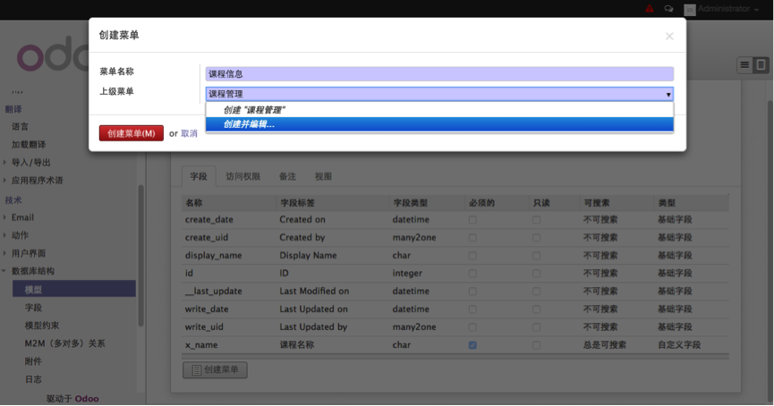 

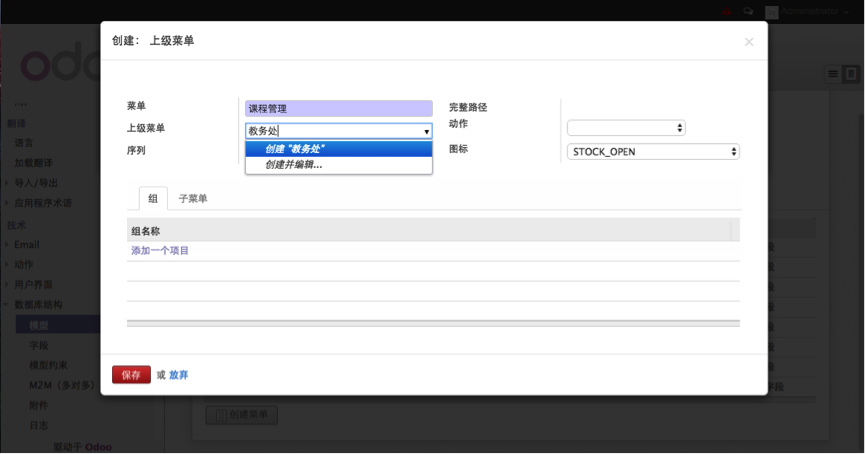 

- 最后点击“保存”=> “创建菜单”。
- 刷新页面后，在顶端能看到一级菜单的名称。
- 点击“教务处”=> “课程管理”=> “课程信息”=> “创建”，在填写表单的界面，发现各个字段是随机排列的，先后顺序与字段的宽度也很乱。

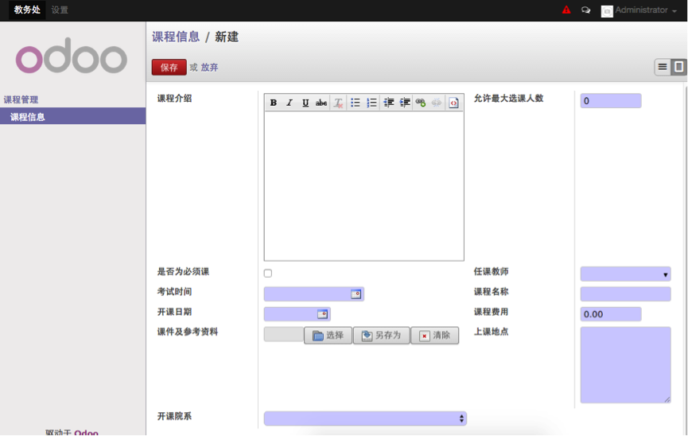

因此需要对表单视图进行调整，使表单按照要求的格式（包括排列顺序和字段宽度）显示出来。

#### 调整表单视图
点击Odoo主页右上角的当前用户名，从打开的下拉菜单中选择“关于Odoo”，然后在弹出框的右上角点击"激活开发者模式"（或者在IP地址栏的web？后加入debug#）。

激活了开发者模式后，能够对视图进行管理。具体操作是：
- 在调试视图栏下选择管理视图。

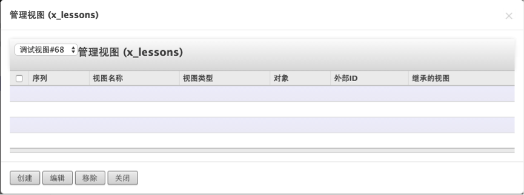

- 点击“创建”一个form类型的视图，输入名称“课程信息显示界面”，点击保存。
- 再点击“编辑”对字段的先后进行操作。可在某一字段前或后添加另一字段。

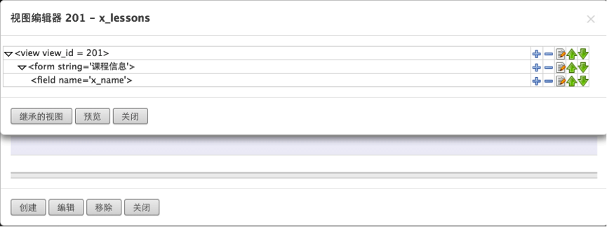

- 除此之外，还能直接进行编写，从而更改显示内容。

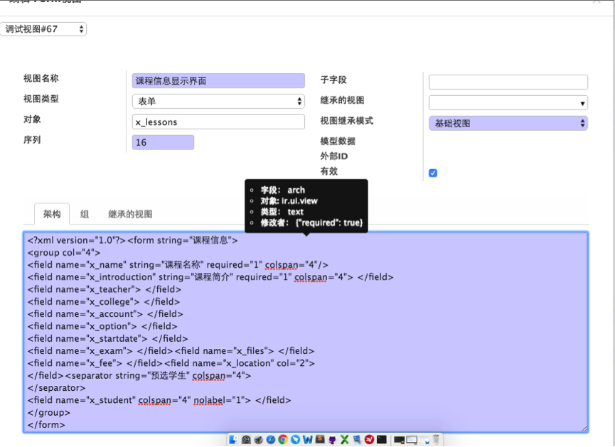

备注：两种方式都可以对字段显示时占的宽度进行设置，也可以加入分割线以及分组，使显示的界面更加美观。

按照上述的方法设置后，在点击创建新表单时的界面如下：

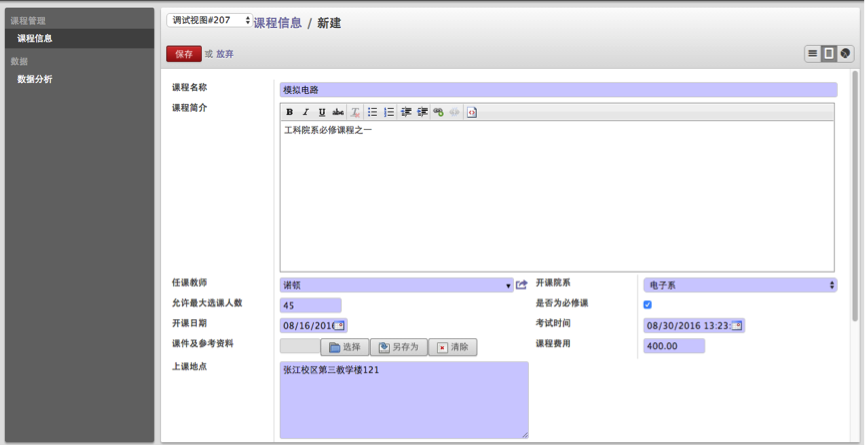

### 新建tree视图
由于课程信息表单内字段较多，我们希望新建完表单保存后，未点击进入表单就能在众多课程信息的列表中看到关键的字段信息，此时我们可以通过新建tree视图来实现这一功能。

在课程信息中，我们希望未点击进入某一表单时就能直接看到“课程名称”、“开课院系”、“任课教师”、“允许最大选课人数”、“开课日期”及“上课地点” 等信息，如下图所示：

这是需要通过编辑tree视图来实现的。具体操作为：
- 激活开发者模式（与上节中的方法相同）。
- 点击“调试视图”，选择“管理视图”，再点击创建“tree”视图，添加您想显示的字段。

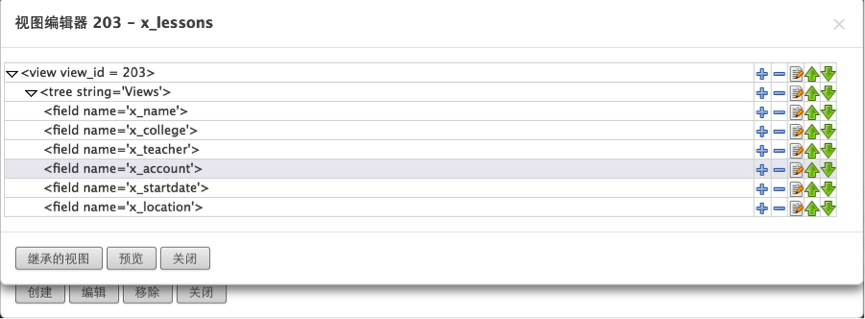

- 点击“关闭”。在下一个窗口仍点击“关闭”，系统会自动刷新，在课程信息列表上方显示的字段即您想要显示的字段。

### 新建搜索视图
当课程信息较多时，我们需要根据某些字段对符合要求的课程进修搜索与筛选，这时我们需要为课程信息这一模型新建搜索视图，实现搜索与筛选的功能。

例如，当课程信息较多时，我们希望根据开课院系或者是否为必修课筛选出满足条件的课程，或者根据课程名称、任课教师或者上课地点上的某些关键字来检索相关课程。我们可以通过搜索视图来实现这一功能。

具体操作步骤如下：
- 激发开发者模式。
- 点击“设置”=>“技术” => “用户界面” => “创建”。
- 输入视图名称，选择视图类型为“搜索”，对象链接到x_lessons。在架构中书写筛选或搜索条件。

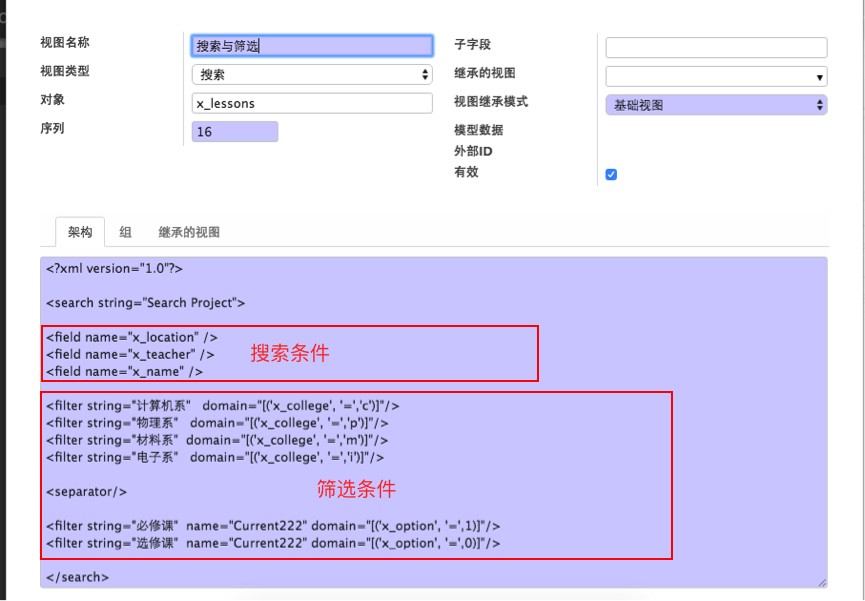

备注：
- Field name后跟的字段是可以搜索出字段中含有该关键字的所有课程。
- Filter string后面是根据字段的值进行筛选，当课程信息中某个字段的值与其相同时，该课程就会被诗选出来。本例中，开课悬系字段是一个下拉框字段，所以可能的取值是有限的，可将所有的取值列出，作为筛选条件。
- 在separator前的过滤条件为“或“的逻辑关系，separator后的过滤条件也是“或”的逻辑关系。但是separator前后的过滤条件为“与”的逻辑关系关系。

按照上述架构所得的筛选条件如下：

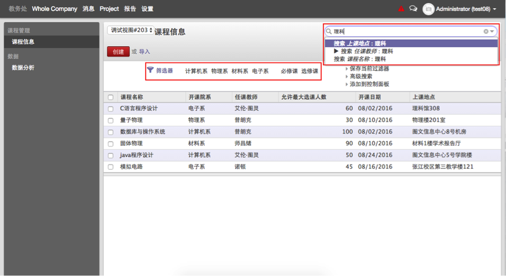

- 筛选条件中，开课院系内部逻辑关系为“或”，即同时选中“计算机系”与“电子系”，则由两个系所开的课程全部会被筛出来。开课院系与是否为必修课逻辑关系为“与”，即若同时选中“物理系”与“必修课”，只有物理系开设的必修课会被筛选出来。
- 搜索条件中，输入文本时，系统会自动提示您按照某个字段中含有该文本进行搜索。如输入“理科”，选择“搜索 上课地点 理科”，则所有在上课地点字段中含有“理科”两个字的课程均会被检索出来。

### 新建图表视图
某些时候我们需要对课程做一些统计，例如统计得出哪些院系开设了多少门课程，这个时候就需要用到graph视图。具体操作如下：
- 激活开发者模式。
- 点击“调试视图”=>“管理视图” => “创建”，选择graph视图，命名并点击“保存”。
- 选择刚刚新建的视图进行编辑，加入想要您想统计的内容对应的字段。

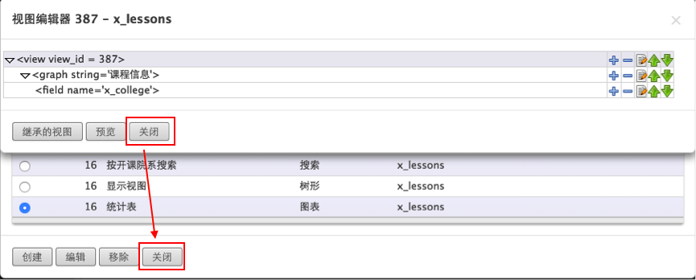

- 点击“关闭”，再单击“关闭”。

系统默认的显示界面上，只显示表单视图，tree视图和搜索视图。我们新建的graph视图默认是不显示的。因此我们需要进行相关操，使得graph视图能够显示在教务系统第三级菜单中。

具体操作如下
- 点击“设置” => “技术” => “用户界面” => “菜单选项”，在搜索框中输入第三级菜单的名称，如“课程信息”。

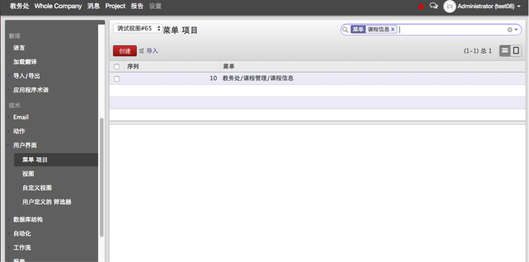

- 点击进入该菜单。点击界面上的“课程信息” 动作，会弹出以下界面。

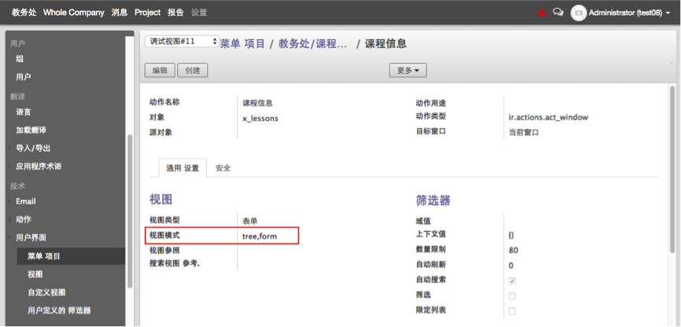

- 点击编辑，将默认的视图模式改为“tree,form,graph”，再点击“保存”。
此时进入到教务系统的主界面，会发现有变化，如下图所示。

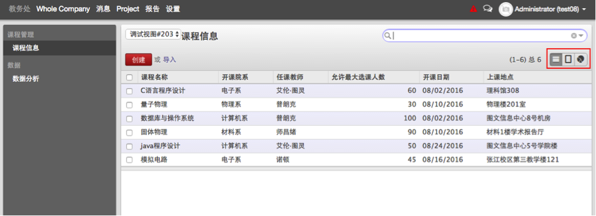

- 从左到右，依次是tree视图，表单视图，graph视图。点击graph视图，会按照先前设置的统计条件，统计各个院系开设的课程数。如下图所示：

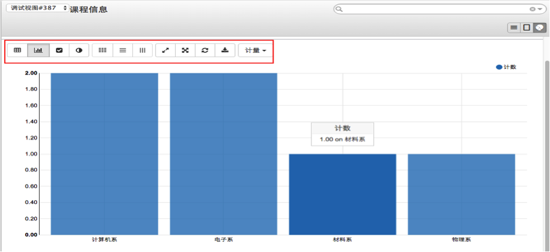

图标上方可以选择不同的显示类型，如从柱状图可切换到饼状图。
