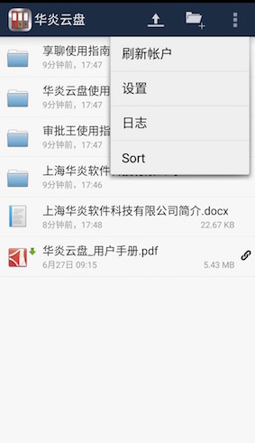

# 安卓客户端简介
华炎云盘安卓设备客户端是上海华炎软件公司专门针对安卓系统而专门开发的一款APP。不同于网页版的华炎云盘，安卓设备版APP
- 拥有于与您的设备完全匹配的更加简易的界面；
- 可以在安卓设备上上传或下载文件，并与您的华炎云盘服务器上的文件实时同步；
- 通过应用密码的设置，使您的华炎云盘更加安全可靠。

## 下载及登录
### 下载
- 在腾讯应用宝、360手机助手、百度手机助手等各大应用市场等中搜索“华炎云盘”并下载到您的手机客户端。
- 或点击华炎云盘官方网页 https://www.steedos.com/cn/drive/downloads/ 下载。

### 登录
- 安装后进入，系统会要求您输入服务器URL。
  - 公有云用户，请输入华炎公有云的URL(https://drive.steedos.com)；
  - 私有云用户，请向您的管理员询要相应URL。
- 输入您在华炎公有云/私有云的用户名和密码。
  - 若您未注册，请点击 https://drive.steedos.com/ 进入华炎云盘官网进行注册，后输入用户名及密码登录。

## 主界面功能键介绍

### 上传文件
您可以选择“文件”或“来自其他APP内容”从安卓设备上传文件到华炎云盘。

### 增加文件夹
您可以点击主界面上方的按钮增加一个新的文件夹。

### “更多”
- 刷新账户：实时同步设备与华炎云盘的文件；
- 设置：可以设置您的账户、应用密码、上传路径等；
- 日志：该功能键可以查看您在华炎云盘上的所有操作历史记录；
- Sort：对文件进行排序。

### 浏览文件
- 点击任意文件，如果您是第一次打开，在设备连接网络的情况下系统会自动从云端下载该文件并保存在您的设备上。
  - 已下载的文件会有一个指向下方的绿色小箭头标记。
  - 下载完毕即可浏览文件。此后，无网络状态时，也可以浏览已经下载的文件。
  - 若您打开某文件，发现无法浏览，并且出现“没有应用可以执行此操作”的提示，请先下载相应的APP（如WPS office）用以浏览您的文件。

### 共享文件
您可以通过两种方式共享您的文件：直接共享（即“发送”）与链接共享(即“分享链接”)。
- 直接共享
  - 长按住某个文件，点击“发送”，选择电子邮件、微信等各种方式将文件直接发送给好友。
  - 采用直接共享发送的文件，无法撤回或取消分享。如果文件较大，也不建议使用该方式。
- 链接共享
  - 您可以长按住某文件，点击“分享链接”，选择通过微信、蓝牙等多种通讯工具将链接分享给您的好友。同时也可以“复制链接”，将链接粘贴至其他通讯工具发送给好友。

####备注： 
  - 如果文件比较大或后续可能取消分享，推荐使用分享链接的方式；
  - 长按某个文件夹，可以将这个文件夹共享给您的好友，此时该文件夹下的所有文件都会被共享；长按被共享过的文件或文件夹，选择“取消共享链接”，可即时停止链接共享。
  - 被共享的文件与文件夹的名称尾部以及文件夹图标将会出现一个被共享符号；

### 修改文件
- 修改文件或文件夹名称

您可以长按某个您想重命名的文件或文件夹，系统将会自动弹出一个选项框，选择“重命名”选项，就可以在新弹出的窗口上输入新的名字了。
- 修改文件内容

如果您急需修改某份文件的内容，而身边没有计算机，您可以在安卓设备上修改您的文件。

以Word版本的文件内容修改流程为例：

1. 先单击某个Word版本文件，由于您在您的安卓设备上预先安装有“WPS Office”APP,则该文件可以在您的WPS Office APP中打开。

2. 选择左上角的“编辑”选项，则您可以在您的安卓设备编辑修改您的文件。 

3. 编辑完成后，点击“保存”，再点击右上角的“X”图标，这样就完成了本地文件的编辑。

4. 在华炎云盘的文件列表显示页面，长按该文件，在弹出的选项框中点击“刷新文件”，则保存在本地的文件的最新版本上传到远程服务器上。

上传完毕后，可见，本文件的时间已经和刚才不一样了。

### 移动文件
- 移动文件
  - 长按住某个文件名（A），点击“移动选项”，选择一个文件夹（B），再点击“Choose”完成文件的移动。则文件A被移动到文件夹B中。
  - 如果为选择任何文件夹，直接点击“Choose”，则文件A将会被移动到根目录下。
- 移动文件夹
  - 您可以长按住某个文件夹名（A），点击“移动选项”，在选择一个文件夹（B），点击“Choose”完成文件夹的移动。此时，A文件夹被移动到B文件夹内部。
  - 如果未选择B文件夹，直接点击“Choose”，则A文件夹会被移动到根目录下。

### 删除文件
由于安卓设备的存储空间有限，为节约空间，您可以删除已下载的文件。
- 长按住某个您已经下载并存储至您的安卓设备的文件，选择“删除”，
  - 点击“仅本地”，则只删除存储在本地设备的文件，而存储在远程服务器的文件予以保留；
  - 点击“远程和本地”，则本地设备和远程服务器中的该文件均会被删除。  

## 设置

###注销账户与修改密码
在设置界面上长按住已存在的账户，界面会自动弹出一个窗口，您可以选择“修改密码”，或者选择“删除账户”来注销已有账户。

### 添加账号
您可以在设置界面上点击选择“添加账户”选项，则系统将进入添加账户界面。输入您的新的用户名与密码后，选择“连接”，则添加账号成功。

###设置应用密码
在设置界面上点击“应用密码”选项，则进入应用密码设置界面。应用密码的设置，为您的信息安全增加一层额外防护。

