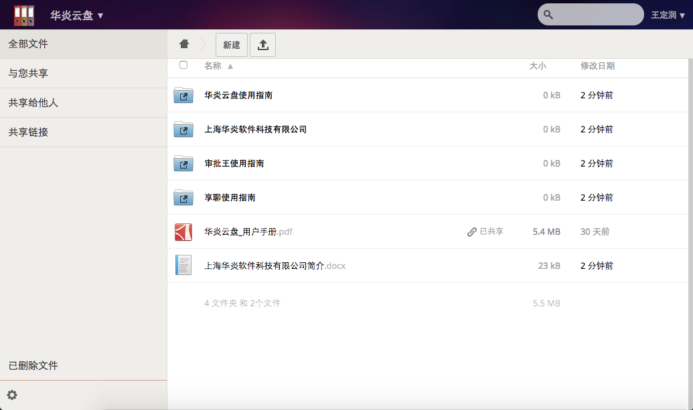
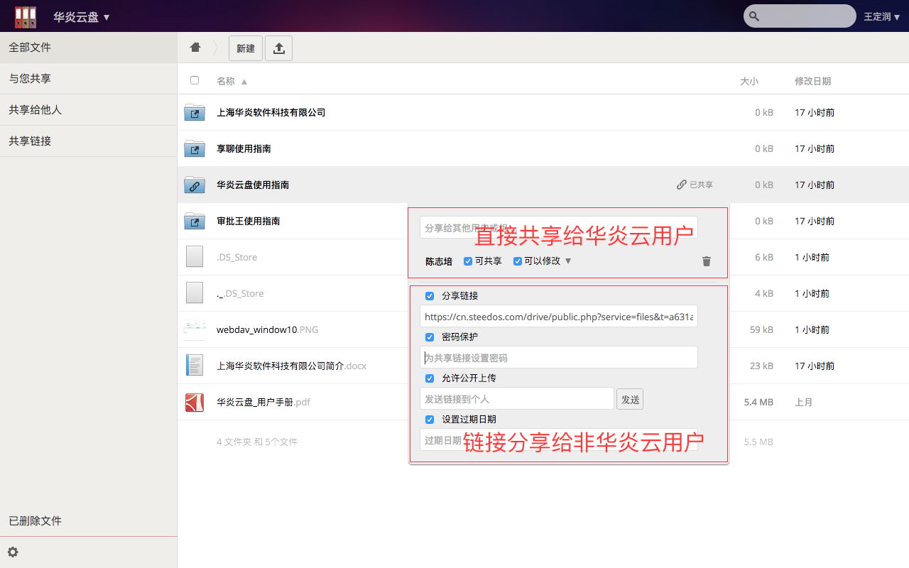

# 使用PC浏览器、华炎云客户端访问华炎云盘
- 您可以在Microsoft Windows、Mac OSX等操作系统的PC或是其他智能手机、平板电脑的浏览器上，使用华炎云盘的全部功能。
- 若您安装了华炎云平台的Windows客户端或Mac客户端，也可以从华炎云客户端进入华炎云盘。

## 导航栏
- [登录与注销](browser.md#登录与注销)
    - [浏览器](browser.md#浏览器)
    - [华炎云客户端](browser.md#华炎云客户端)
- [文件夹操作](browser.md#文件夹操作)
    - [文件夹导航](browser.md#文件夹导航)
    - [新建文件夹](browser.md#新建文件夹)
    - [修改文件夹](browser.md#删除文件夹)
    - [移动文件夹](browser.md#移动文件夹)
    - [删除文件夹](browser.md#删除文件夹)
    - [共享文件夹](browser.md#共享文件夹)
    - [下载文件夹](browser.md#下载文件夹)
- [文件操作](browser.md#文件操作)
    - [文件上传](browser.md#文件操作)
    - [文件版本](browser.md#文件版本)

## 登录与注销
### 浏览器
1. 输入网址URL（公有云是 https://cn.steedos.com/drive/ ，如果您登录的是私有云，请与管理员确认网址）。
1. 输入您的用户名和密码。
1. 点击“登录”按钮，华炎云盘的主界面将会打开。
1. 如果您要退出系统，请点击右上角的用户名，再点击“注销”选项，即可退出华炎云盘。

### 华炎云客户端
1. 运行华炎云客户端。
1. 输入用户名、密码，并进入华炎云平台。
1. 点击“云盘”，即可进入华炎云盘系统。
1. 如果您要注销，点击右上角的用户名，再点击“注销”即可。

## 文件夹操作

### 文件夹导航
系统主界面的左侧有“全部文件”，“与您共享”，“共享给他人”，“共享链接”，“已删除文件”等选项。
- 全部文件：显示根栏目下的所有文件夹及文件，包括其他同事共享给您的文件夹和文件
- 与您共享：显示所有共享给您的文件夹及文件
- 共享给他人：显示所有您共享给他人的文件夹（含链接共享）及文件
- 共享链接：显示所有您链接共享给他人的文件夹及文件
- 已删除文件：显示所有被删除的文件及文件

显示文件夹时，右侧的上方有导航条，显示该文件夹当前的绝对路径。点击首页图标，则跳转显示“全部文件”；点击其中的某个文件夹，则跳转显示相应的文件夹。

### 新建文件夹
如果您想新建一个文件夹，请点击导航栏后的新建按钮，并选择文件夹，输入文件夹名称即可。

### 修改文件夹
如果您想修改某一文件夹的名称，则点击该文件夹名称随后的修改图标，输入修改后的名称即可。

### 移动文件夹
- 移动到同级文件夹
  - 鼠标点住文件夹A，并拖动到同级文件夹B处，即可将A文件夹移动到B文件夹下。
- 移动到更高层级的文件夹下
  - 选中文件夹A，并拖动到上方导航条上的某个文件夹B处，即可将A文件夹移动到B文件夹下。
- 批量移动文件夹
  - 如果您想移动某几个文件夹，则点击子文件夹图标后的勾选框，拖动鼠标至其他文件夹或上方导航条上的某个上级文件夹处，即可将这几个文件夹移动到另一文件夹下。

### 删除文件夹
- 删除单个文件夹
  - 如果您想删除某一文件夹，点击该文件夹这一行最右侧的删除图标。
- 批量删除文件夹
  - 如果您想删除某几个子文件夹，则点击子文件夹图标后的勾选框。接着，点击第一行的删除图标，即可批量删除文件夹。

删除后的文件夹 会出现在左下角链接“已删除文件”中，点击可进入查看和恢复。
- 若要恢复该文件，则点击“恢复”图标即可。不需要恢复的文件，180天后，系统会自动进行永久删除。
- 若您要手动永久删除，点击右侧的删除图标。

尽管如此，由于每个用户的存储空间限制，系统可能在未到达180天时便对文件进行永久删除。一旦保留的已删除文件的大小达到可使用空间大小的50%，系统将自动从最早的版本文件开始启动永久删除，直至满足保留的已删除文件的大小不超过可使用空间大小的50%为止。

### 共享文件夹

**直接共享**

若您想分享某一文件夹给**华炎云盘的其他用户**，则点击子文件夹名称后的分享图标，输入用户的邮箱，点击回车，系统会自动检索用户名并显示在下方，选择该用户即可分享。
- 文件夹共享后，在本人云盘主界面左侧的“共享给他人”中也能看到这个文件夹，且该文件夹上会出现分享标志。
- 文件夹共享后，在被共享人的云盘主界面左侧的“与您共享”中也能看到这个文件夹，且文件夹上也会出现共享标志。
- 您可以对于分享的文件进行权限设置：可共享；可以修改（创建，更新，删除）。
- 您还可以删除分享，点击分享账户后的删除图标即可。

**链接共享**

如果想将某一个子文件夹下的内容共享给**非华炎云盘用户的其他人员**，则可以使用文件夹的“分享链接”功能。

点击子文件夹名称后的分享图标，勾选“分享链接”， 其中的 (https://drive.steedos.com/public.php?service…) 就是可访问本文件夹的URL，您可以对其进行更多的辅助的设置：
  - 密码保护:设置共享链接的密码。
  - 过期日期 :设置共享链接的过期日期。
  - 发送提醒邮件: 输入被分享人的邮箱，并点击“发送”按钮即可发送提醒邮件。 

文件夹共享链接后，在分享人云盘主界面左侧的“共享给他人”、“共享链接”中会出现该文件夹，同时，该文件夹上会出现分享标志。

### 下载文件夹
- 如果您想下载某一文件夹内的所有内容，则点击该文件夹名称后的下载图标，即可将子文件夹下的所有文档打包为ZIP文件下载到本地。
- 如果想下载某几个文件夹下的所有文档，则点击子文件夹图标后的勾选框，然后点击第一行的下载图标，即可将所选文件夹、文件打包为ZIP文件并下载到本地。

## 文件操作
对于移动文件，下载文件，删除文件，共享文件和修改文件名称等操作，此处不再赘述，请您参考文件夹的相关操作。

现介绍华炎云盘内几个比较比较特别的操作。

### 文件上传
- 点击上传
  - 点击导航条后面的上传图标，弹出选择文件的页面，选择后点击“打开”即可，如果不上传，点击“取消”。
- 拖动上传
  - 将文件管理器（Windows系统下的）或Finder（Mac下的）的一个或多个文件拖进 相应文件夹 即可。

### 文件版本
**生成新版本**

如果上传的新文件与文件夹中已经存在的文件重名，则系统弹出冲突处理页面。
  - 如果勾选新文件，则新上传的文件为这个文件的最新版本，而原文件则成为历史版本。这时，点击文件名后的“版本”图标，则出现此文件的历史版本。
  - 如果勾选已经存在的文件，则不上传新的文件。
  - 如果同时勾选了两个文件，则新上传的文件名会加一个数字，这样，文件夹中的文件就是两个，而不是一个文件的两个版本。

**恢复旧版本**

如果要恢复某个旧版本，则点击文件名称后的“版本”图标，此时将会出现此文件的所有历史版本，点击需要恢复的版本后面的“恢复”图标，则此版本成为最新版本，而原来的最新版本成为历史版本。

**版本保留机制**

上传同名文件时，系统会生成新的版本。由于用户存储空间大小有限，每次生成新版本时，系统会作自动检查来删除某些旧版本，以控制空间。
  - 1小时内，每1分钟可以保留一个版本；
  - 24小时内，每1小时可保留一个版本；
  - 前30天，每1天只保留一个最新版本；
  - 30天后，每1个星期保持一个最新版本。

此外，增加新版本时不会使用超过该用户目前可用空间的50%。如果存储不同版本文件所占据的存储容量超过此限制，则系统会自动删除旧版本直到满足空间限制。

