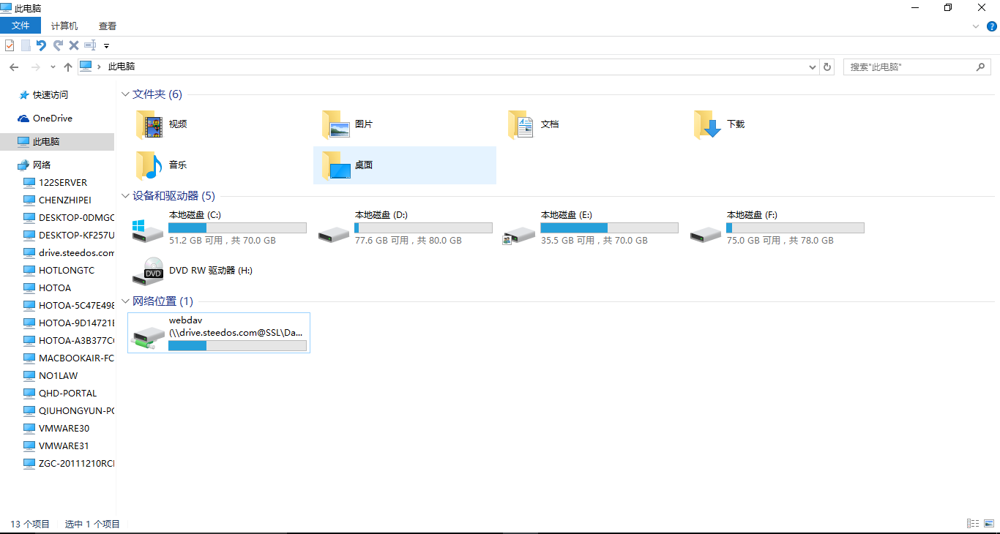
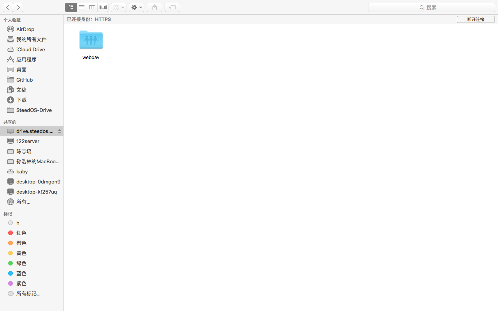

# 使用WebDAV访问华炎云盘
WebDAV（Web-based Distributed Authoring and Versioning）是一种基于 HTTP 1.1协议的通信协议。

它在GET、POST、HEAD等几个HTTP标准方法以外添加了一些新的方法，使应用程序可直接对Web Server直接读写，并支持写文件锁定(Locking)及解锁(Unlock)，还可以支持文件的版本控制 。

## 导航栏
- [Microsoft Windows](webdav.md#microsoft-windows)
  - [Windows 7](webdav.md#windows-7)
  - [Windows 10](webdav.md#windows-10)
- [MAC OSX](webdav.md#mac-osx)
>>>>>>> origin/master

华炎云盘同时提供了WebDAV服务，使得您可以在Microsoft Windows、Mac OSX等操作系统中，使用WebDAV来访问华炎云盘里的文件，从而能像浏览器一样对云盘的文件进行操作。
## Microsoft Windows
### Windows 7 
通过资源管理器访问华炎云盘，请作如下操作：

1. 打开资源管理器；
1. 选择窗口上部的“映射网络驱动器”；
1. 选择驱动器（例如Y盘），输入文件夹为华炎云盘WebDAV的服务器地址：https://drive.steedos.com/remote.php/webdav/ ；
1. 点击“完成”，再输入用户名与密码，点击“确定”按钮；
1. 在资源管理器中，增加Y盘（drive.steedos.com）；

点击即可进入华炎云盘系统，您可以在这里查看、增加、移动、删除文件，这些操作与在Web页面的操作是同步的。
### Windows 10 
1.	在桌面上键入“win”+“R” ，左下角会弹出命令框。输入cmd，点击确定。
2.	在光标闪烁处输入“ipconfig”命令，按下回车键。
3.	在弹出的数据中找出本机的IPv4地址。在光标闪烁处键入“start\\\"+本机IPv4地址”，如start\\\192.168.0.147。再回车。
4.	在弹出的界面上点击左侧的网络，再点击右键选择“映射网络驱动器”。
5.	在弹出界面的文件夹处键入华炎云盘webdav的服务器地址：https://drive.steedos.com/remote.php/webdav/ ，再点击“完成”。
7.	再键入您的华炎云账号及密码，点击“确定”。

此时，在计算机的网络位置中会出现“webdav”文件夹，点击即可访问华炎云盘，对其内部文件进行操作。

## MAC OSX
通过MAC OSX Finder访问华炎云盘，请按以下步骤操作：

1. 打开Finder；
2. 选择页面顶端的“前往”，再点击 “连接服务器”；
3. 在弹出的界面输入华炎云盘WebDAV的服务器地址：https://drive.steedos.com/remote.php/webdav/ ；
4. 点击“连接”按钮，选择连接身份为“注册用户”，并输入用户名、密码，点击“连接”按钮；
5. 连接成功后，Finder中“共享的”路径下会增加“drive.steedos.com”文件夹；
6. 点击 “drive.steedos.com”文件夹内的“webdav”即进入华炎云盘。

您可以在这里查看、增加、移动、删除文件，这些操作与在Web页面的操作是同步的。

