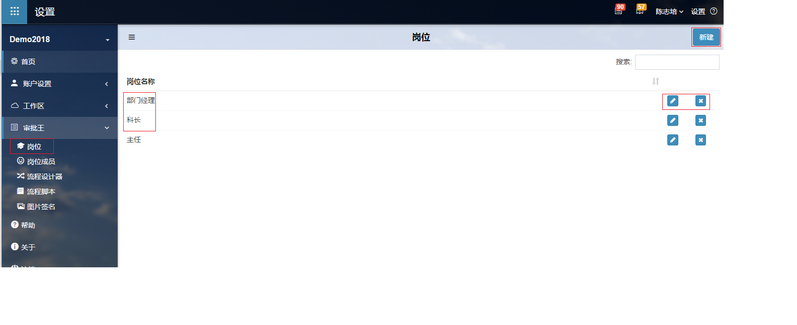
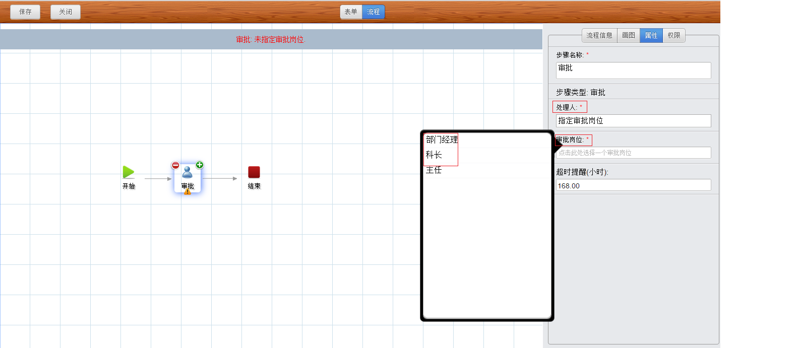
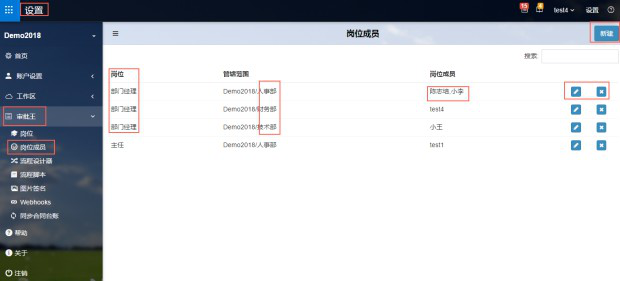
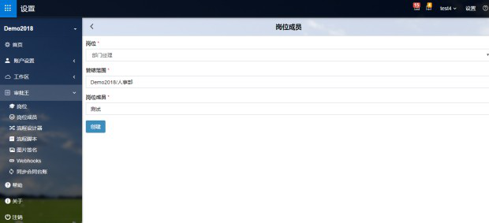

### 设置岗位
管理员在设计审批流程时，需要对“岗位”和“岗位成员”进行设置。因为当审批流程的某一处理步骤的“处理人”类型是“指定审批岗位”时，“审批岗位”中的选项就是就是管理员所设置的“岗位”； 
例如：当在“岗位”中新建了“部门经理”，“科长”等时，审批流程中的“审批岗位”的选项中就包括了“部门经理”，“科长”；

 
 
 注意：审批流程的设计，请参考“表单设计”的帮助文档。
 #### 岗位设置的详细步骤：
 - 设置界面中，点击“审批王”后，点击“岗位”。
 - 点击右上角的“新建”按钮后弹出新建岗位的弹出框，在“岗位名称”中填写新建岗位的名称后，点击“创建”按钮，完成审批岗位的新增。
 -  在岗位列表页中，点击岗位名右侧的“笔形状”按钮、“×”按钮，可以对该岗位进行修改、删除。
 
### 设置岗位成员
“岗位人员”类似员工在实际工作中担任的职位。假设“岗位”是“部门经理”，“岗位人员”则对应具体的部门的部门经理，例如人事部的“部门经理”，财务部的“部门经理”，技术部的“部门经理”。

 - 在图中可以看到，每个“部门经理”的岗位，对应的“管辖范围”就是具体部门（如：技术部，财务部，人事部），而“岗位成员”则是任命的部门经理。
 - 注意：任命的部门经理也可以是多人。
 
#### 岗位成员设置的详细步骤：
 - 设置界面中，点击“审批王”后，点击“岗位成员”，再点击新建后，会弹出“岗位成员”的弹出框。
 
 - 选择已建立的审批岗位，如“部门经理”，指定岗位成员（可以是多个人员）、管辖范围。
 - 点击“创建“按钮完成。
 - 在岗位列表页中，点击岗位名右侧的“笔形状”按钮、“×”按钮，可以对该岗位进行编辑、修改。
 
#### 基于“岗位”来定义流程的优点：
 - 减小了人员调整对流程设置的影响：
  如果部门经理要换人，假设有10个流程都定义了某步骤为这个人处理，那么就需要分别修改这10个流程。而如果这10个流程的步骤是审批岗位“部门经理”处理，那么就无需修改这10个流程，只需在审批岗位的设置中，将此部门的部门经理换为他人即可。

### 注意

- **一个用户可以对应多个岗位** ，例如，同一个人，既是办公室的部门经理，也是公司的办公室主任。
- **一个岗位也可以有多个用户**，（对应相同或不同的审批范围即部门）。例如，“部门经理”的岗位，可以财务部的岗位成员1人、人事部的岗位成员是2人，这样，人事部的审批过程中，有时需要在这两个部门经理中选择一人。
