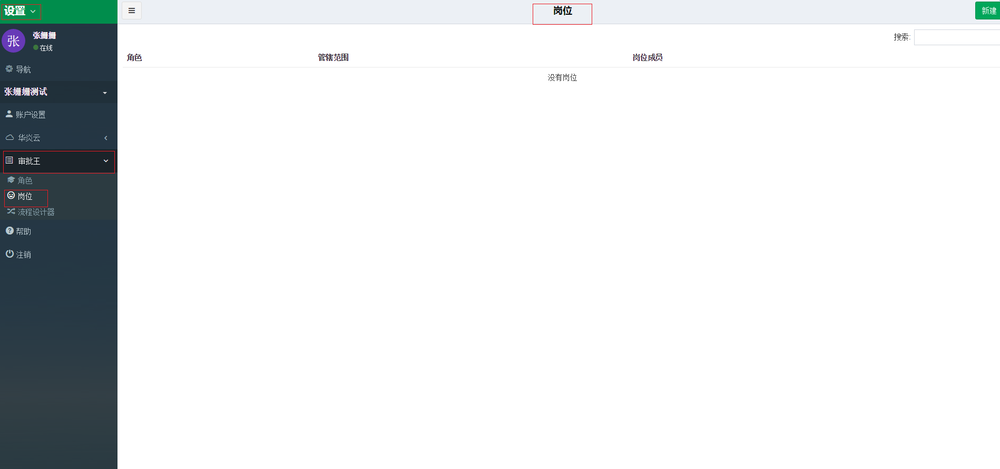

## 设置角色与岗位
管理员设置完人员与部门后，还需要对公司的职能岗位进行设置，这里的岗位便于后续的审批流程设计。管理员可通过设置部门经理这个岗位来对某一步骤进行审批处理。系统会根据提交人找到其相应的部门，再从设置好的岗位里找到该部门的经理。
因此，在设置岗位时，该岗位对应的审批范围（即部门）的定义务必要精准。

#### 审批岗位的作用

在“审批王”中，“角色”与“岗位”类似员工在实际工作中担任的职位。以“角色”是部门经理为例，假设部门一的部门经理是A，部门二的部门经理是B，那么在“审批王”中，
 - 可以先定义一个“角色”为“部门经理”
 - 然后在“岗位”中定义各部门的部门经理由谁担任,如部门一的部门经理是A的设置过程就是，在“岗位”中新增，“角色”选择“部门经理”，“管辖范围”设置为部门一，“岗位成员”设置为A。
 - 同时，我们可定义某流程的步骤“部门经理审批”的处理人为审批岗位“部门经理”。如此，实际审批时，系统会依据提交者的不同来找对应的“部门经理”：如果提交者属于部门一则由A来处理；提交者属于部门二则由B来处理。

#### 详细操作步骤如下
- 新增审批岗位
 - 登入华炎云主界面，点击“设置”，再点击“审批王”后，点击“角色”，点击右上角的“新建”按钮。
 - 请在系统自动弹出的对话框上填写新增的审批岗位的名称，如“财务总监”。
 - 点击“创建”按钮，完成审批岗位的新增。

- 审批岗位人员设置
 - 点击“设置”，再点击“审批王”后，点击“岗位”，点击右上角的“新建”按钮。
 - 选择已建立的审批岗位，如“财务总监”，指定岗位成员（可以是多个人员）、管辖范围。
 - 点击“创建“按钮完成。
 - 要注意审批范围，比如财务，审批范围是全公司，而不是财务部。
 

- 修改/删除审批岗位
 - 在岗位列表页中，点击右侧的“编辑”或“删除”按钮，可以对该岗位进行编辑、修改。
 
##### 基于“审批岗位”来定义流程的优点：
- 直接定位与提交者相关的特定人员
  如上面的示例，如果“部门预审”不定位处理人为审批岗位“部门经理”，就需要定义处理人为一群人（他们是各个部门的部门经理），那么系统就无法识别不同提交者对应的不同部门经理，而只能由提交者自己作选择。这么做，既降低了效率，也可能出错。
- 减小了人员调整对流程设置的影响
  如果部门经理要换人，假设有10个流程都定义了某步骤为这个人处理，那么就需要分别修改这10个流程。而如果这10个流程的步骤是审批岗位“部门经理”处理，那么就无需修改这10个流程，只需在审批岗位的设置中，将此部门的部门经理换为他人即可。

在“审批王”中，

- **一个用户可以对应多个岗位。**例如，同一个人，既是办公室的部门经理，也是公司的办公室主任。
- **一个岗位也可以有多个用户**（对应相同或不同的审批范围即部门）。例如，“部门经理”下，可以包括办公室的部门经理1人、生产部的部门经理2人、财务部的部门经理1人等。这样，生产部的审批过程中，有时需要在这两个部门经理中选择一人。
