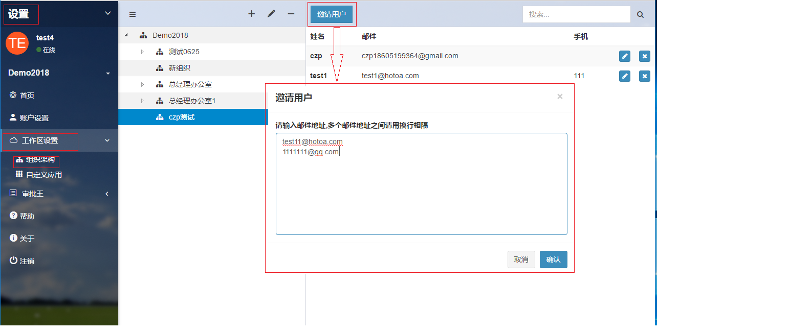

## 设置组织架构：人员
  管理员添加完部门之后，继续添加人员账号。
  
  在添加人员时可以把人员放置在所属的部门中，设置用户的直属上级和用户状态。当用户状态是“有效”时可正常使用，如需要暂停使用此人员账户时可设置为无效。

   
#### 邀请用户
- 进入“设置”，再点击“工作区”后，点击“组织架构”，再点击右边的“+”按钮。
- 输入新用户的邮件地址，多个邮件地址之间请用换行相隔。
- 点击“确认”按钮，系统将发送激活邮件到该用户的信箱，新用户通过点击激活链接设置密码、登录审批王。
- 激活邮件发送之后，三天内点击有效。三天后，连接失效，可重新邀请。

#### 导入用户
- 进入“设置”，再点击“工作区”后，点击“组织架构”，再点击“导入”按钮。
- 在弹出的导入窗口上，点击“选择文件”按钮。
- 文件选择之后，点击“数据检验”，数据检验成功之后，点击“导入”按钮。
- 具体规则如下：
    - 选择的数据文件必须为Excel，并且excel中，列的排序必须跟下方“数据预览”保持一致。您可以先下载“导入模板”，系统会为您新增一个excel，新增的excel中每一列跟下方“数据预览”中保持一致，您需要把对应的数据拷贝到新的excel中。
    - 部门必须为全路径（例如：上海华炎软件/研发部）。如果部门不存在，则自动创建
    - 导入用户如果不存在，则自动创建; 只有新建的用户支持设置密码
    - 导入用户如果存在，并且已加入当前工作区，则修改用户信息。如果导入的属性为空，则不修改此属性值
    - 数据校验时，会验证用户名、手机号、邮箱等是否合理、是否重复，如果某一条数据有问题，系统会给出相应提示。
备注：新增人员账号时，默认是有效账号，如果要对该账户停用的话，取消选择有效即可。

#### 编辑人员
进入人员列表页面，点击右侧的笔形状的按钮，修改人员的姓名、选择所属部门、指定直属上级（直属上级的设置与流程设计中的节点属性相关）。

备注：审批王支持一个用户属于多个部门。

#### 导出用户
- 进入“设置”，再点击“工作区”后，点击“组织架构”。
- 在右侧的组织架构中选择要导出的部门，选中之后点击“导出”按钮。
- 选择导出的文件保存路径，确定即可。
  
   
#### 删除人员
- 进入人员列表页面，点击右侧的“X”按钮，对该账号进行删除。
- 如是暂时停止使用此人员账号，可到人员编辑页面将账号状态设置为无效。

